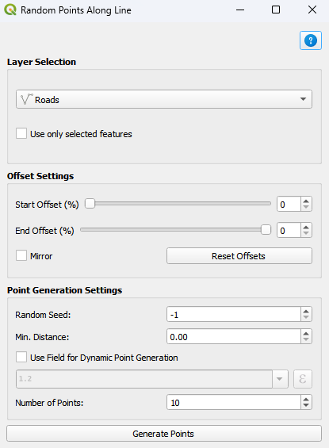
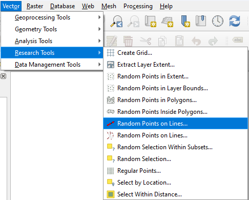

# Random Points on Lines...

Random Points on Lines... is a free open-source plugin for QGIS where to generate random points on line layers, enhancing spatial data analysis by quickly simulating random data points.

Random Points on Lines... designed for efficiency and ease of use.

Random Points on Lines... is a user-friendly dialog interface to select the line layer and specify the number of random points.

The resulting random points are added as a new memory layer with additional attributes, including coordinates in both the layer's CRS (XCoord_, YCoord_) and the project's CRS (XCoordProjCRS, YCoordProjCRS), as well as a distance field (Distance) indicating the distance from the start of the line to the point location. 

The points are customized with a size of 2.3 and a red color for better visualization.

The extension is available from the official repository [QGIS plugins page](https://plugins.qgis.org/plugins/). 

Use the QGIS Plugins menu to install the Random Points on Lines... [QGIS manual](https://docs.qgis.org/3.34/en/docs/user_manual/plugins/plugins.html).

Random Points on Lines... is under development and test with QGIS 3.34.

## Functionality

- Allows users to generate a specified number of random points along selected line layers.
- Allows users to choose specific line layers from the active QGIS project to apply random point generation.
- Allows users to set the exact number of random points to generate for better control and flexibility.

## Interface

  

## Small Manual on How to Use the Script

**1.	Loading the Plugin:**

    - Ensure that the script is correctly placed in the QGIS plugin folder.
    - Open QGIS and load the plugin. The plugin's interface should open in a dialog window.

**2.	Using the Dialog Interface:**

    - Layer Selection: Use the dropdown to select a line layer from your project. Only line layers will be listed.
    - Number of Random Points: Enter the number of random points you want to generate along the selected line layer.
    - Buttons:
      - **OK:** Click this button to generate the random points. The plugin will create a new memory layer containing the random points, with attributes for ID, distance along the line, and coordinates in both the layer and project CRS.
      - **Cancel:** Click this button to close the dialog without generating any points.

**3.	Viewing and Analyzing the Output:**

    - The random points will be added to the QGIS map canvas as a new layer named "Random Points."
    - The point symbols are customized with a size of 2.3 and a color of #db1e2a for clear visualization.
    - Attributes include:
      - **ID:** A unique identifier for each point.
      - **Distance:** The distance of each point along the line.
      - **XCoord_ & YCoord_:** Coordinates in the layer's CRS.
      - **XCoordProjCRS & YCoordProjCRS:** Coordinates in the project’s CRS.

## Tutorial 

Guide for **Random Points on Lines...** is available here: [Random Points on Lines...](https://gis.com.my/training/qgis-plugin/random-points-on-lines/)

## Installation

Go to *Plugins > Manage and Install Plugins.. > All*.

Search for **Random Points on Lines...**.

OR

Download the zip file in [Github](https://github.com/gisinnovationmy/RandomPointsonLines).

Go to *Plugins > Manage and Install Plugins.. > Install from ZIP*.

After installation, the plugin will appear under *Vector* menu and *Research Tools* submenu.

  

## License

This plugin is distributed under GNU GPL v.2 or any later version.

## Support

We've just begun and have implemented basic functionality so far. Our goal is to expand the range of services and introduce new features.

We appreciate any feedback, and pull requests are welcome on **GitHub**.

To get started, refer to the user guide, or you can ask questions and share comments in the discussion section.